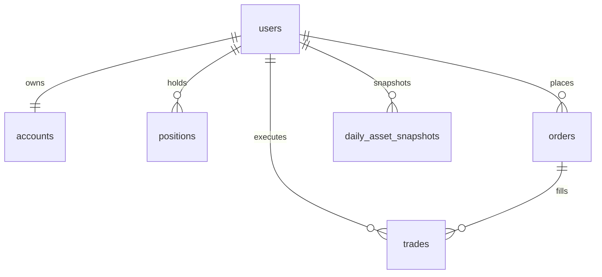

# 数据库设计

主要表：users, accounts, positions, orders, trades, daily_asset_snapshots, trading_day_states。

关键约束：
- users.username / users.email 唯一
- positions(user_id, symbol) 唯一
- orders(user_id, idempotency_key) 唯一
- daily_asset_snapshots(user_id, date) 唯一
