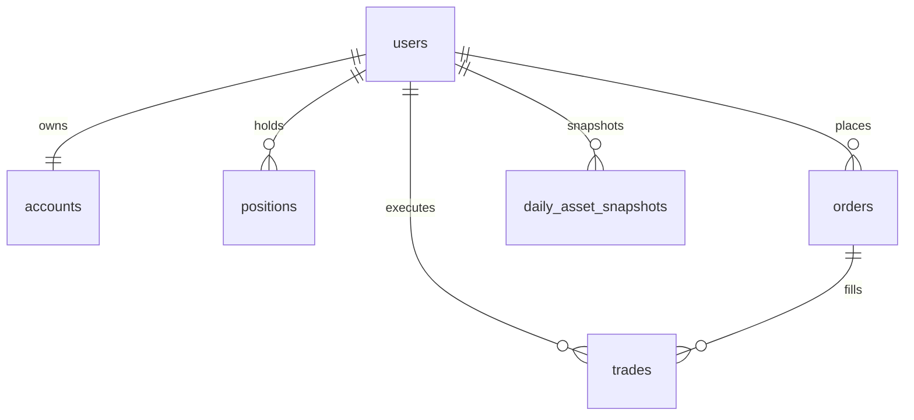

# 数据库设计

主要表：users, accounts, positions, orders, trades, daily_asset_snapshots, trading_day_states。

关键约束：
- users.username / users.email 唯一
- positions(user_id, symbol) 唯一
- orders(user_id, idempotency_key) 唯一
- daily_asset_snapshots(user_id, date) 唯一

订单增强字段（Phase 2）：
- order_type: MARKET / LIMIT
- limit_price: 限价单价格
- remaining_quantity: 未成交数量
- reserved_cash: 买入限价单冻结资金
- cancelled_at: 撤单时间
- rejection_reason: 拒单原因
